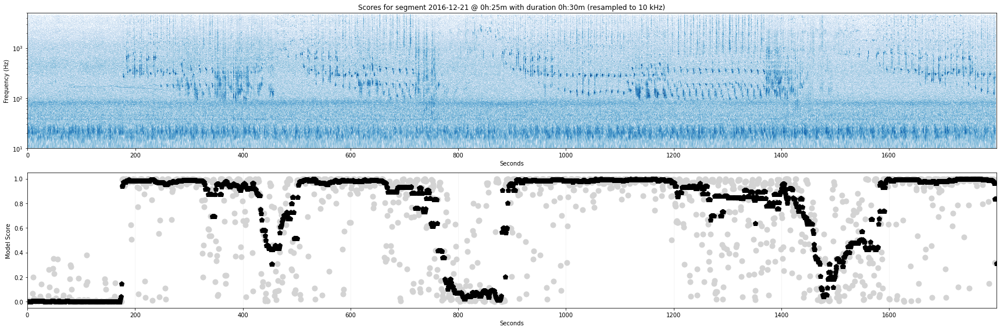

# Detecting Humpback Whale Song

Applying the NOAA/Google Humpback Whale Song Detector on Pacific Ocean Sound data.

References:

- <https://tfhub.dev/google/humpback_whale/1>
- <https://doi.org/10.1109/OCEANS.2016.7761363>

Some notebooks where code developed here has been used:

- <https://colab.research.google.com/drive/13HinPes8vi39yjb7nD3ZULpB3eXZFxvc>
- <https://colab.research.google.com/drive/11gxYzDKPgyqncu1ooiTrH-iWtemkFIJJ>

See also: <https://docs.mbari.org/pacific-sound/>.



## Setup

This project uses [uv](https://docs.astral.sh/uv/) for dependency management.

Install uv if you haven't already:

    just install-uv

Or manually:

    curl -LsSf https://astral.sh/uv/install.sh | sh

Then set up the project:

    just setup

### Using GPU?

Per https://www.tensorflow.org/install/pip:

    uv pip install 'tensorflow[and-cuda]'
    uv run python3 -c "import tensorflow as tf; print(tf.config.list_physical_devices('GPU'))"

> The output of the verification above may look like:
> ```
> [PhysicalDevice(name='/physical_device:GPU:0', device_type='GPU'), PhysicalDevice(name='/physical_device:GPU:1', device_type='GPU')]
> ```

## Want to use this on your machine?

Default settings and examples below are mainly in terms of our own setup on
a particular machine ("gizo"), where `/mnt/PAM_Analysis/` is a base directory
for various locations.
Although some scripts here accept options to set relevant locations,
you may also find convenient to directly adjust the
`DEFAULT_AUDIO_BASE_DIR` and `DEFAULT_SCORE_BASE_DIR` settings
in [hwsd/file_helper.py](hwsd/file_helper.py).

## Gizo

On gizo, a copy of the code in this repo is located under
`/opt/humpback/humpback-whale-song-detection/`. 

Base directories:

- `/mnt/PAM_Analysis/decimated_16kHz/` - Input audio files sampled at 16kHz

- `/mnt/PAM_Analysis/GoogleHumpbackModel/decimated_10kHz/` - Input audio files resampled to 10kHz

- `/mnt/PAM_Analysis/GoogleHumpbackModel/Scores/` - Generated score files

With 2016-11-01 as an example:

`/mnt/PAM_Analysis/GoogleHumpbackModel/Scores/2016/11/Scores-20161101.npy`

will be the model score file corresponding to the audio file:

`/mnt/PAM_Analysis/decimated_16kHz/2016/11/MARS-20161101T000000Z-16kHz.wav`

via the intermediate, decimated 10kHz version at:

`/mnt/PAM_Analysis/GoogleHumpbackModel/decimated_10kHz/2016/11/MARS-20161101T000000Z-10kHz.wav`

## Resampling to 10kHz

Note that the NOAA/Google model requires the input signal to be sampled at 10kHz.

We do the necessary resampling beforehand using [`sox`](http://sox.sourceforge.net/). 

- `resample_sox.sh`:
  For a given year and month, this script starts multiple `sox`
  processes concurrently, one for each day of the month. Example:

        ./resample_sox.sh 2018 11

- `resample_year_months.sh`:
  A convenient script that runs `resample_sox.sh` in sequence for all
  given months in a given year.
  For example, to resample Jan–Oct'2018:

        ./resample_year_months.sh 2018 $(seq 1 10)

A recent resampling exercise on gizo (Sept to Dec, 2021):

    cd /opt/humpback/humpback-whale-song-detection
    nohup ./resample_year_months.sh 2021 $(seq 9 12) > logs/nohup_resample_2021_9_to_12.out &

    nohup ./resample_year_months.sh 2022 $(seq 1 3) > logs/nohup_resample_2022_1_to_3.out &

## Applying the model

Run `hwsd/apply_model.py` indicating the years, months, and days to process.

Usage:

    hwsd/apply_model.py time-interval ...

where each time interval must be of the form
`yearRange/monthRange/dayRange` or `yearRange/monthRange`,
with each range fragment either a single number or a hyphen-separated
range with inclusive limits. If omitted, the day range will be "1-31".
The code takes care of adjusting the day range depending on the calendar month.

Example: To apply the model on the six months Oct–Dec'2020 and Jan–Mar'2021:

    nohup uv run python3 -u hwsd/apply_model.py "2020/10-12" "2021/1-3"

Some of our runs on gizo have been like the following:

    mkdir -p logs

Two concurrent jobs to process Jan–Aug'2021:

    nohup uv run python3 -u hwsd/apply_model.py "2021/1-4" > logs/nohup-2021--1-4.out &
    nohup uv run python3 -u hwsd/apply_model.py "2021/5-8" > logs/nohup-2021--5-8.out &

Four concurrent jobs (one per month) to process Sept–Dec'2021:

    for mr in 9 10 11 12; do
        nohup uv run python3 -u hwsd/apply_model.py "2021/$mr" > "logs/nohup-2021--$mr.out" &
    done

Five concurrent jobs to process Jan–Oct'2018:

    for mr in 1-2 3-4 5-6 7-8 9-10; do
        nohup uv run python3 -u hwsd/apply_model.py "2018/$mr" > "logs/nohup-2018--$mr.out" &
    done

Four concurrent jobs to process 2017:

    for mr in 1-3 4-6 7-9 10-12; do
        nohup uv run python3 -u hwsd/apply_model.py "2017/$mr" > "logs/nohup-2017--$mr.out" &
    done

NOTE: 
`hwsd/apply_model.py` is mainly a convenience to run the actual core function
`apply_model_day` on multiple days. In particular, note that `HOURS_PER_CALL`
and `MODEL_MINUTES` are two key settings that you may need to adjust depending
on available memory on the system. See `hwsd/apply_model.py` for more details. 

You can also run `hwsd/apply_model_day.py` directly and with options from the
command line to set any relevant parameters as needed.
Run the following for usage:

    hwsd/apply_model_day.py --help

## Generating plots

This repo also includes code to generate plots with spectrograms and scores,
which mainly helped with initial validations.

In this case, no command line arguments are expected.
Edit `hwsd/plot_scores.py` as needed to indicate the
years, months, and days to process. Then, run it:

    hwsd/plot_scores.py

Each generated plot file will be located next to the corresponding score file.

Note that `hwsd/plot_scores.py` is a convenience to run the actual core function
`plot_scores_day` on multiple days. 
For a particular day you can also run `hwsd/plot_scores_day.py` directly.
Run the following for usage:

    hwsd/plot_scores_day.py --help

---

## Development

With the environment setup in place using uv:

    just setup

run the following on a regular basis as you work with the code:

    just dev

This task does code formatting, type checking, testing, and linting.

See [`justfile`](justfile) for all available tasks.
